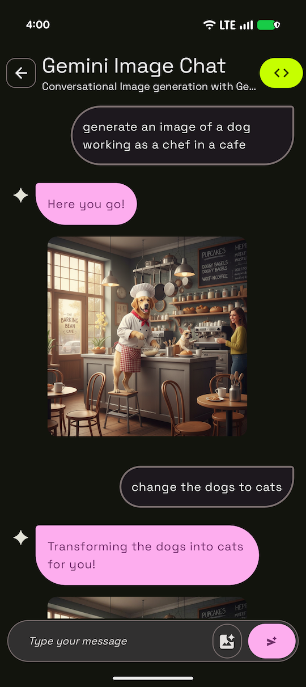
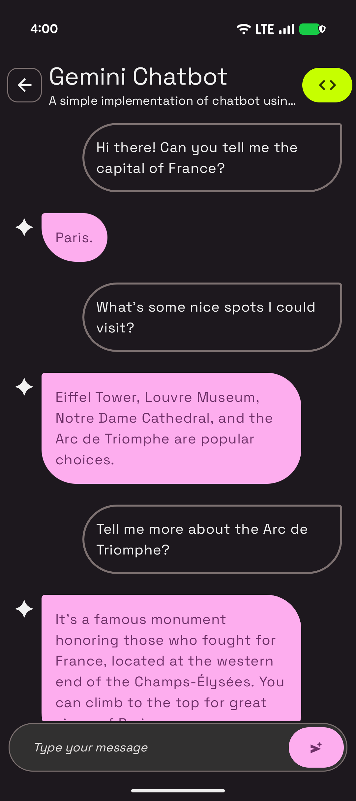
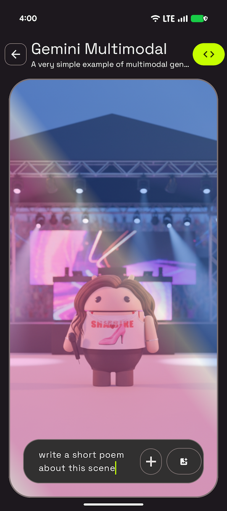
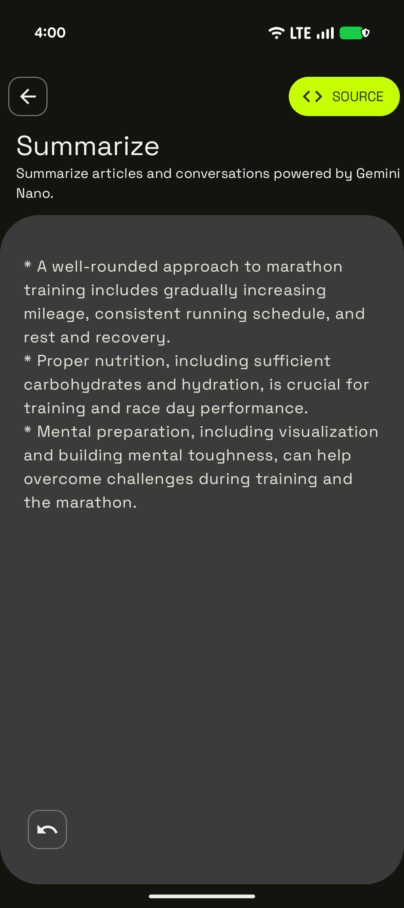
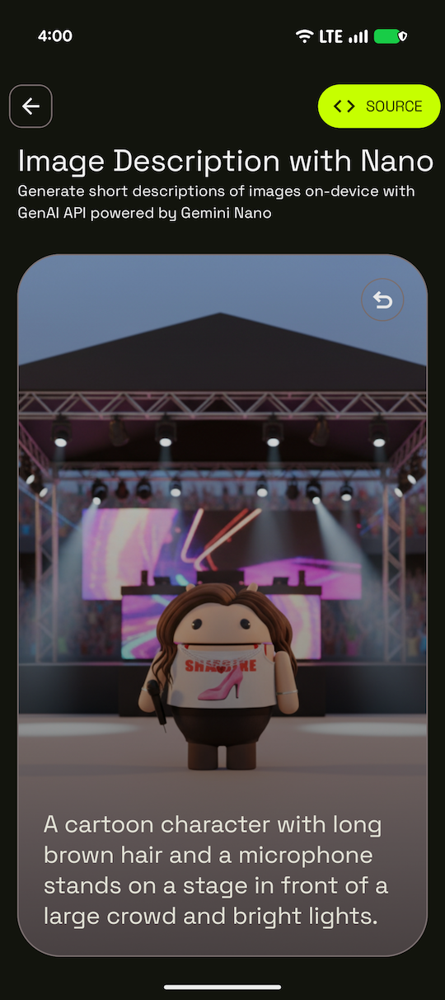
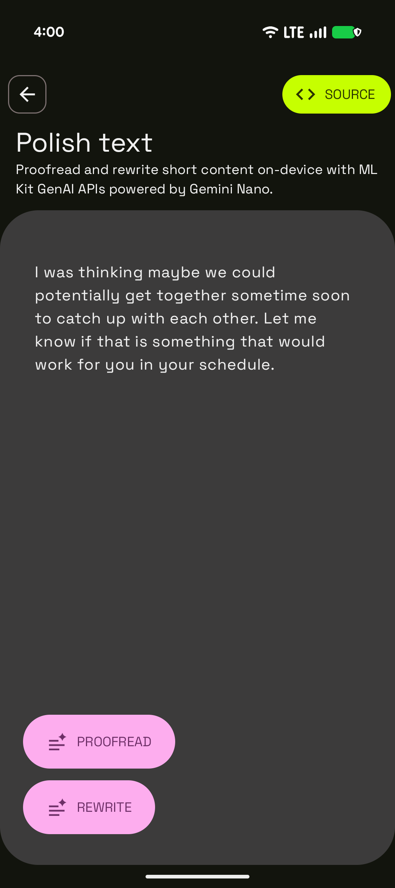
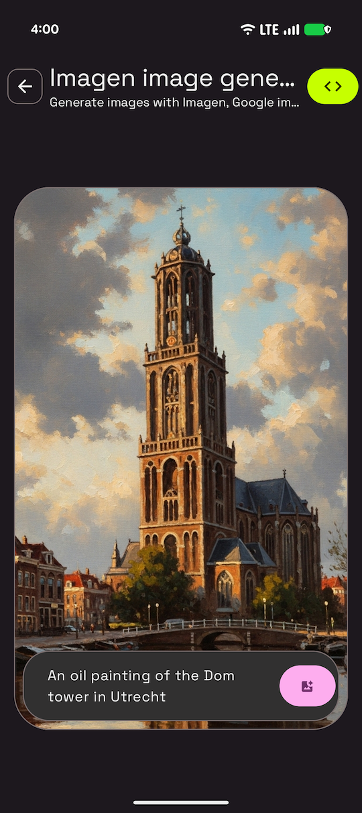
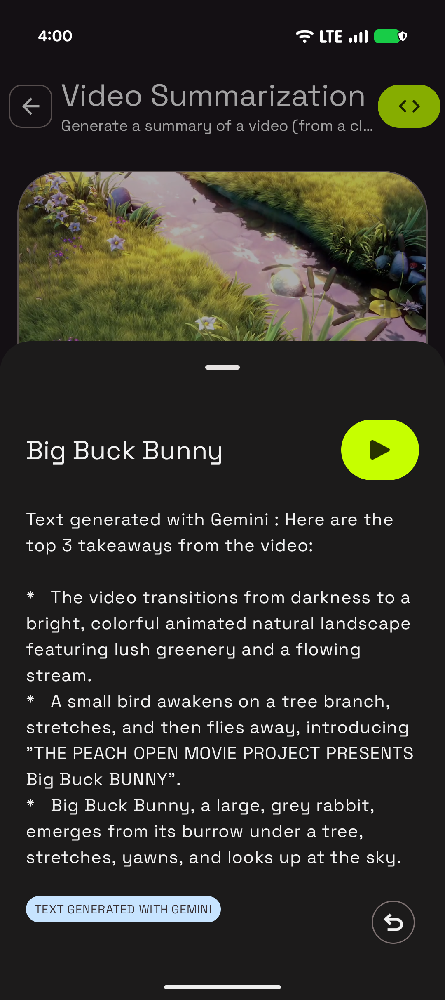
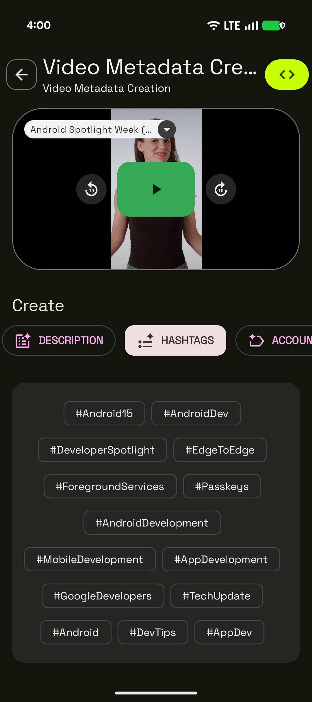
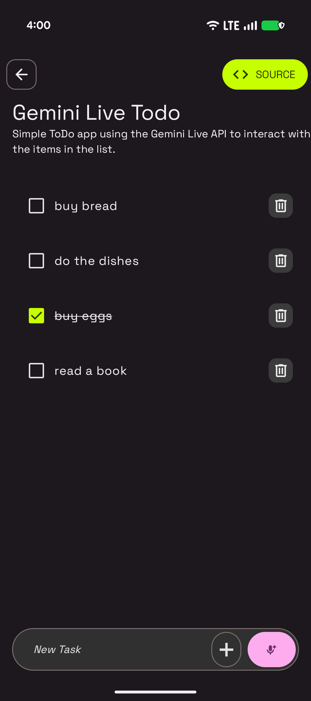

# Android AI Sample Catalog


This folder contains the Android AI Sample catalog, a stand alone application giving you access to 
individual self-contained samples illustrating some of the Generative AI capabilities unlocked by 
some of Google's models.

> **Note:** These samples are intended to showcase specific AI capabilities in isolation, and they may use
> simplified code. They are demo not intended to be used as production-ready code.
> For best practices follow our documentation and check
> [Now In Android](https://github.com/android/nowinandroid)

💻 Requirements
------------
- **Cloud samples**: the samples relying on Google cloud models (Gemini Pro, Gemini Flash, Imagen, etc...) require setting up a Firebase project and connecting the app to Firebase (read more [here](https://firebase.google.com/docs/ai-logic/get-started?platform=android&api=dev#set-up-firebase)).
- **On-device samples**: the samples relying on Gemini Nano need to be run on a supported device, and can't run on an emulator.

🧬 Samples
------------

| Project                                                                                                                                                                                                                                                                                                            |                                                                                                                 |
|:-------------------------------------------------------------------------------------------------------------------------------------------------------------------------------------------------------------------------------------------------------------------------------------------------------------------|-----------------------------------------------------------------------------------------------------------------|
| <br>**gemini-image-chat** <br><br> a sample using the new [Gemini 2.5 Flash Image model](https://developers.googleblog.com/en/introducing-gemini-2-5-flash-image/) (a.k.a. "NanoBanana") enabling image generation and iterations via chat interactions <br><br> **[> Browse](samples/gemini-image-chat)**<br><br> |                           |
|                                                                                                                                                                                                                                                                                                                    |                                                                                                                 |
| <br>**gemini-chatbot** <br><br> a simple chatbot using Gemini Flash <br><br> **[> Browse](samples/gemini-chatbot)**<br><br>                                                                                                                                                                                        |                          |
|                                                                                                                                                                                                                                                                                                                    |
| <br>**gemini-multimodal** <br><br> a single screen application leveraging text+image to text generation with Gemini Flash <br><br> **[> Browse](samples/gemini-multimodal)**<br><br>                                                                                                                               |                    |
|                                                                                                                                                                                                                                                                                                                    |
| <br>**genai-summarization** <br><br> a text summarization sample using Gemini Nano <br><br> **[> Browse](samples/genai-summarization)**<br><br>                                                                                                                                                                    |                  |
|                                                                                                                                                                                                                                                                                                                    |
| <br>**genai-image-description** <br><br> an image description sample using Gemini Nano <br><br> **[> Browse](samples/genai-image-description)**<br><br>                                                                                                                                                            |          |
|                                                                                                                                                                                                                                                                                                                    |
| <br>**genai-writing-assistance** <br><br> a proofreading and rewriting sample using Gemini Nano <br><br> **[> Browse](samples/genai-writing-assistance)**<br><br>                                                                                                                                                  |                   |
|                                                                                                                                                                                                                                                                                                                    |
| <br>**imagen** <br><br> an image generation sample using Imagen <br><br> **[> Browse](samples/imagen)**<br><br>                                                                                                                                                                                                    |                         |
|                                                                                                                                                                                                                                                                                                                    |
| <br>**magic-selfie** <br><br> an sample using ML Kit subject segmentation and Imagen for image generation <br><br> **[> Browse](samples/magic-selfie)**<br><br>                                                                                                                                                    |                              |
|                                                                                                                                                                                                                                                                                                                    |
| <br>**gemini-video-summarization** <br><br> a video summarization sample using Gemini Flash <br><br> **[> Browse](samples/gemini-video-summarization)**<br><br>                                                                                                                                                    |  |
|                                                                                                                                                                                                                                                                                                                    |
| <br>**gemini-video-metadata-creation** <br><br> a sample using Gemini Flash to generate a video description, hashtags, chapters, etc... <br><br> **[> Browse](samples/gemini-video-metadata-creation)**<br><br>                                                                                                    |   |
|                                                                                                                                                                                                                                                                                                                    |
| <br>**gemini-live-todo** <br><br> a todo list app using Gemini Live <br><br> **[> Browse](samples/gemini-live-todo)**<br><br>                                                                                                                                                                                      |                      |


> 🚧 **Work-in-Progress:** we are working on bringing more samples into the application.

## How to run

1. Clone the repository
2. Open the whole project in Android Studio.
3. Set up a Firebase project and connect your app to Firebase by adding your Firebase configuration 
file (`google-services.json`) to the `/app` directory. Read more in the [Firebase documentation](https://firebase.google.com/docs/ai-logic/get-started?platform=android&api=dev#set-up-firebase) and the [Android-specific setup guide](https://firebase.google.com/docs/android/learn-more?authuser=0#google-services-plugin-and-file).
4. Sync & Run `app` configuration

The app will open with the samples list screen that allows you to navigate throughout the different 
available samples.

## Reporting issues

You can report [issues with the samples](https://github.com/android/ai-samples/issues) using
this repository. When doing so, make sure to specify which sample you are referring to.

## Contributions

We aren't open to contribution to this project at the moment.

## License

```
Copyright 2023 The Android Open Source Project
 
Licensed under the Apache License, Version 2.0 (the "License");
you may not use this file except in compliance with the License.
You may obtain a copy of the License at

    https://www.apache.org/licenses/LICENSE-2.0

Unless required by applicable law or agreed to in writing, software
distributed under the License is distributed on an "AS IS" BASIS,
WITHOUT WARRANTIES OR CONDITIONS OF ANY KIND, either express or implied.
See the License for the specific language governing permissions and
limitations under the License.
```
