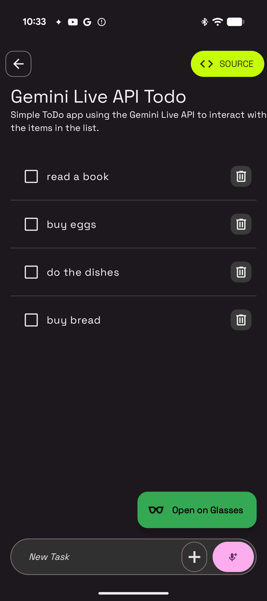
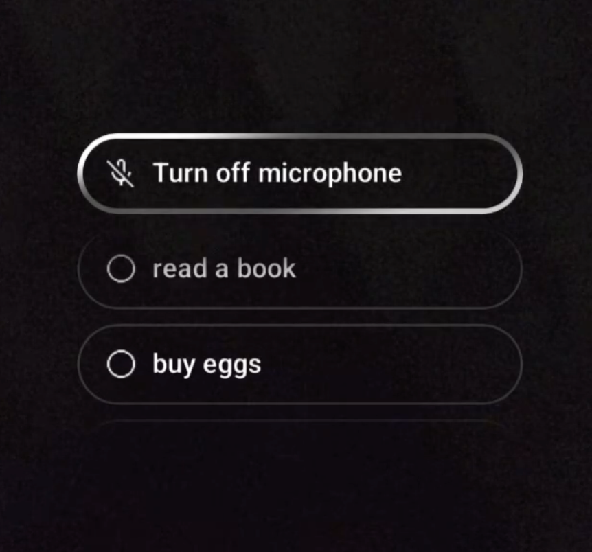
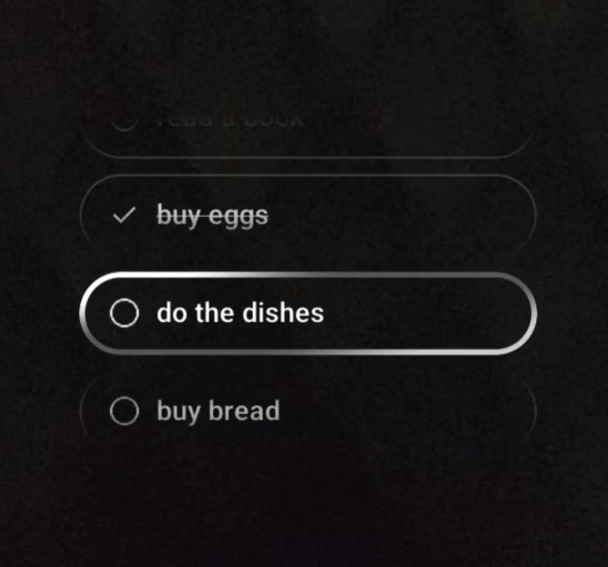

# Gemini Live Todo AI Glasses Sample

This sample is part of the [AI Sample Catalog](../../). To build and run this sample, you should clone the entire repository.

This sample was built with Android Studio Quail 1 Canary 3. Get the latest [Android Studio Canary](https://developer.android.com/studio/preview) to access the AI glasses emulator and its latest features.

## Description

This sample demonstrates how to use the Gemini Live API for real-time, voice-based interactions in a simple ToDo application. Users can add, remove, and update tasks by speaking to the app, showcasing a hands-free, conversational user experience powered by the Gemini API.

<div style="text-align: center;">

</div>

## How it works

The application uses the Firebase AI SDK (see [How to run](../../#how-to-run)) for Android to interact with Gemini Flash. The core logic is in the [`TodoScreenViewModel.kt`](./src/main/java/com/android/ai/samples/geminilivetodo/ui/TodoScreenViewModel.kt) file. A `liveModel` is initialized with a set of function declarations (`addTodo`, `removeTodo`, `toggleTodoStatus`, `getTodoList`) that allow the model to interact with the ToDo list. When the user starts a voice conversation, the model processes the spoken commands and executes the corresponding functions to manage the tasks.

Here is the key snippet of code that initializes the model and connects to a live session:

```kotlin
val generativeModel = Firebase.ai(backend = GenerativeBackend.vertexAI()).liveModel(
    "gemini-2.0-flash-live-preview-04-09",
    generationConfig = liveGenerationConfig,
    systemInstruction = systemInstruction,
    tools = listOf(
        Tool.functionDeclarations(
            listOf(getTodoList, addTodo, removeTodo, toggleTodoStatus),
        ),
    ),
)

try {
    session = generativeModel.connect()
} catch (e: Exception) {
    Log.e(TAG, "Error connecting to the model", e)
    liveSessionState.value = LiveSessionState.Error
}
```
# Google AI Glasses Support
This prototype sample demonstrates how to extend the Gemini Live experience to Google AI Glasses.

The prototype illustrates how to leverage the glasses' form factor for a heads-up display (HUD) experience while maintaining the core application logic on the host device.

<div style="text-align: center;">

</div>

<div style="text-align: center;">

</div>

## Tech Stack
The glasses integration is built using the following libraries:

### Jetpack Projected:
Used to manage the connection and service lifecycle between the host application (phone) and the client display (glasses). This allows the application to "project" its content onto the glasses.

### Jetpack Compose Glimmer:
The UI for the glasses is constructed using Glimmer, an Android UI toolkit optimized for transparent, wearable displays.

Read more about the Gemini Live API in the Android Documentation.
Read more about the [Gemini Live API](https://developer.android.com/ai/gemini/live) in the Android Documentation.