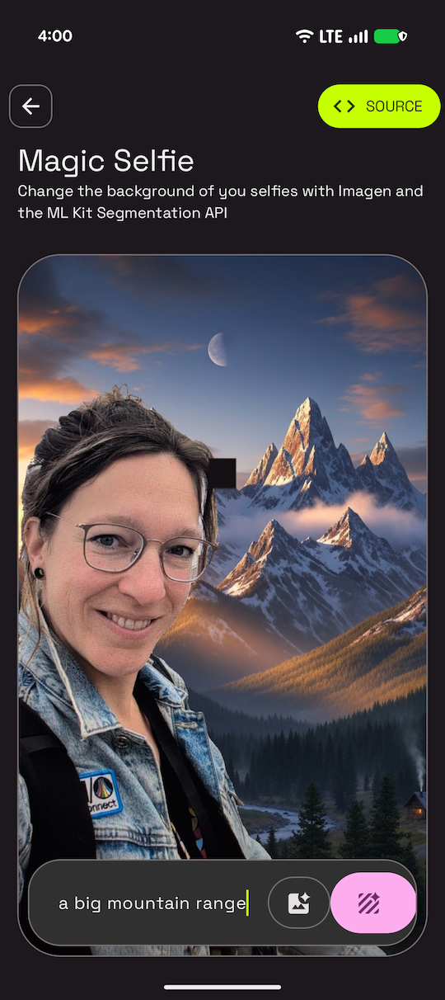

# Magic Selfie Sample

This sample is part of the [AI Sample Catalog](../../). To build and run this sample, you should clone the entire repository.

## Description

This sample demonstrates how to create a "magic selfie" by replacing the background of a user's photo with a generated image. It uses the Gemini 3.1 Flash Image model (a.k.a. Nano Banana 2) to replace the background in a single pass.

<div style="text-align: center;">

</div>

## How it works

The application uses the Firebase AI SDK (see [How to run](../../#how-to-run)) for Android to interact with the Nano Banana 2 model (`gemini-3.1-flash-image-preview`) to replace the background of a user's selfie with a new background generated from a text prompt. The core logic for this process is in the [`MagicSelfieViewModel.kt`](./src/main/java/com/android/ai/samples/magicselfie/ui/MagicSelfieViewModel.kt) and [`MagicSelfieRepository.kt`](./src/main/java/com/android/ai/samples/magicselfie/data/MagicSelfieRepository.kt) files.

Here is the key snippet of code that orchestrates the magic selfie creation from [`MagicSelfieViewModel.kt`](./src/main/java/com/android/ai/samples/magicselfie/ui/MagicSelfieViewModel.kt):

```kotlin
private val generativeModel = Firebase.ai(backend = GenerativeBackend.googleAI()).generativeModel(
    modelName = "gemini-3.1-flash-image-preview",
    generationConfig = generationConfig {
        responseModalities = listOf(ResponseModality.IMAGE)
    },
    systemInstruction = content {
        text("In the provided image, replace the background with the one described in the prompt. Keep the person in the foreground exactly as they are.")
    },
)

suspend fun generateMagicSelfie(bitmap: Bitmap, prompt: String): Bitmap {
    val content = content {
        image(bitmap)
        text(prompt)
    }
    val response = generativeModel.generateContent(content)
    val resultImage = response.candidates.firstOrNull()?.content?.parts?.firstNotNullOfOrNull { it.asImageOrNull() }
    return resultImage ?: throw Exception("Failed to generate magic selfie")
}
```

Read more about the [Gemini API](https://developer.android.com/ai/gemini) in the Android Documentation.
